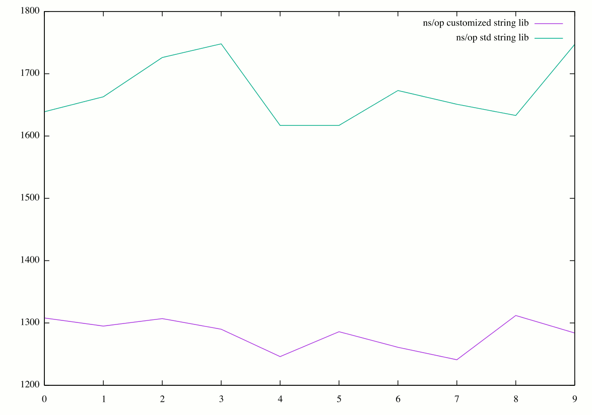

# Benchmarks for 2 string libraries

It was fun reading K&R once again. Out of curiosity i set out to
implement a substring search function in go. It wasn't an easy task for a
newbie programmer like me. Due to multiple frustrations i decided to
peek at the go standard string library to see how it is done. 

The standard strings library has a method called "Contains" that does what i need:

e.g

strings.Contains(str, subs) &#x2013;> returns bool

However, i noticed that strings.Contains() calls another funciton
called Index(): 
     func Index(s, sep string) int

I immediately noticed that this function made the len(s) call 3
times. I curiosly added the following code:

m := len(s)

and replaced all 3 len(s) called with m.

Committed code can be found here:
<https://github.com/mesb/go/commit/5a56f4ea49b14f2251f64d7e38fbd8f892e13ac1>

Thanks to some hospitable people on the #go-nuts IRC channel, i
learned to do benchmarks on such experiments.

Here is the test directory:
<https://github.com/mesb/tests>

and below are the benchmark results

## Test Results

<table border="2" cellspacing="0" cellpadding="6" rules="groups" frame="hsides">

<colgroup>
<col  class="right" />

<col  class="right" />
</colgroup>
<thead>
<tr>
<th scope="col" class="right">ns/op customized string lib</th>
<th scope="col" class="right">ns/op std string lib</th>
</tr>
</thead>

<tbody>
<tr>
<td class="right">1308</td>
<td class="right">1639</td>
</tr>

<tr>
<td class="right">1295</td>
<td class="right">1663</td>
</tr>

<tr>
<td class="right">1307</td>
<td class="right">1726</td>
</tr>

<tr>
<td class="right">1290</td>
<td class="right">1748</td>
</tr>

<tr>
<td class="right">1246</td>
<td class="right">1617</td>
</tr>

<tr>
<td class="right">1286</td>
<td class="right">1617</td>
</tr>

<tr>
<td class="right">1261</td>
<td class="right">1673</td>
</tr>

<tr>
<td class="right">1241</td>
<td class="right">1651</td>
</tr>

<tr>
<td class="right">1312</td>
<td class="right">1633</td>
</tr>

<tr>
<td class="right">1284</td>
<td class="right">1747</td>
</tr>
</tbody>
</table>

## Average ns/op

<table border="2" cellspacing="0" cellpadding="6" rules="groups" frame="hsides">

<colgroup>
<col  class="right" />

<col  class="right" />
</colgroup>
<thead>
<tr>
<th scope="col" class="right">customized lib</th>
<th scope="col" class="right">standard lib</th>
</tr>
</thead>

<tbody>
<tr>
<td class="right">1283</td>
<td class="right">1671.4</td>
</tr>
</tbody>
</table>

In effect, the golang len(string) has to be made faster.

